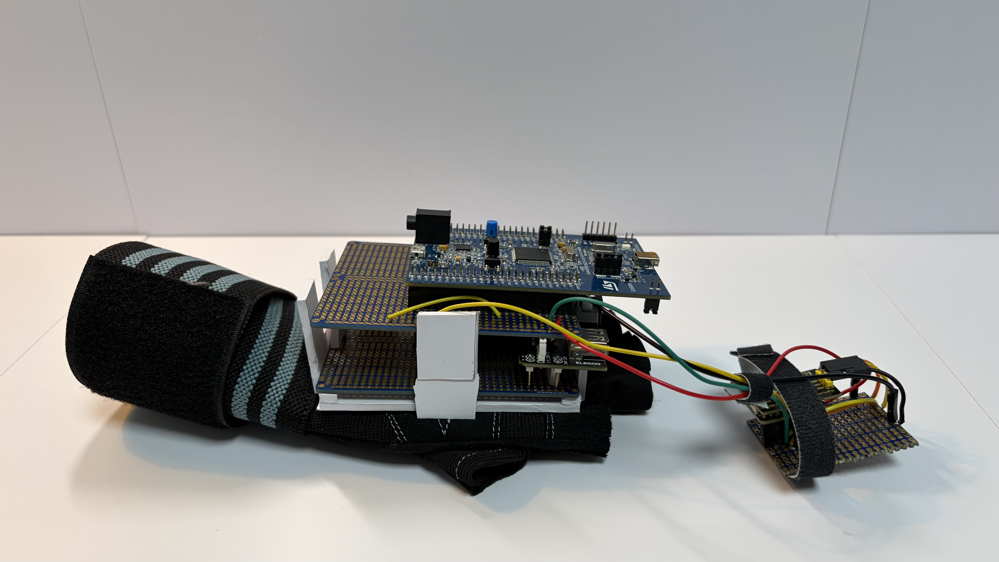
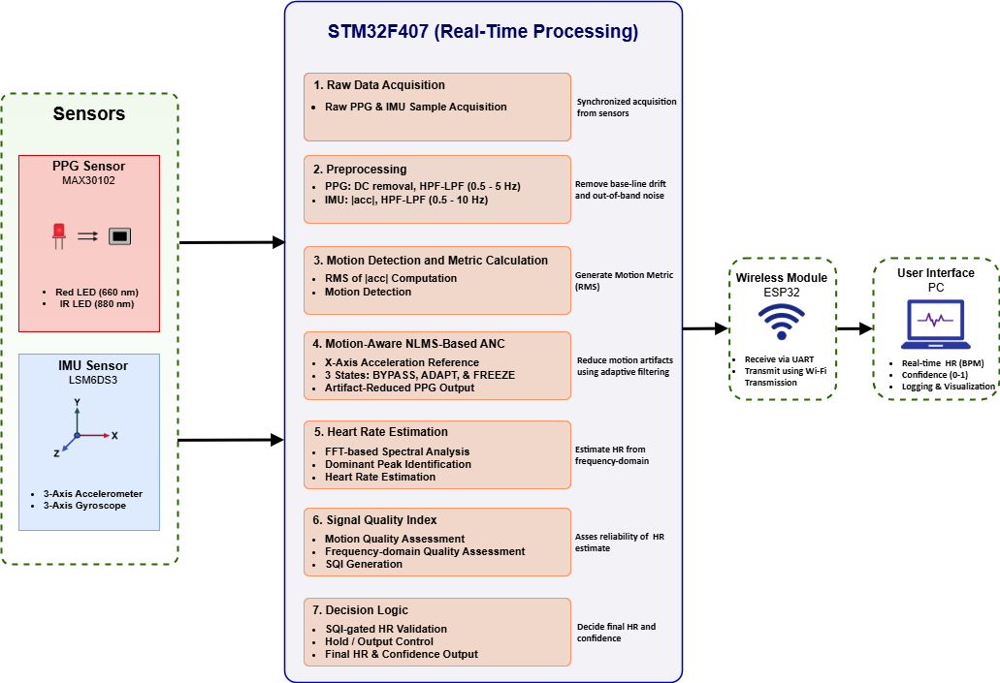
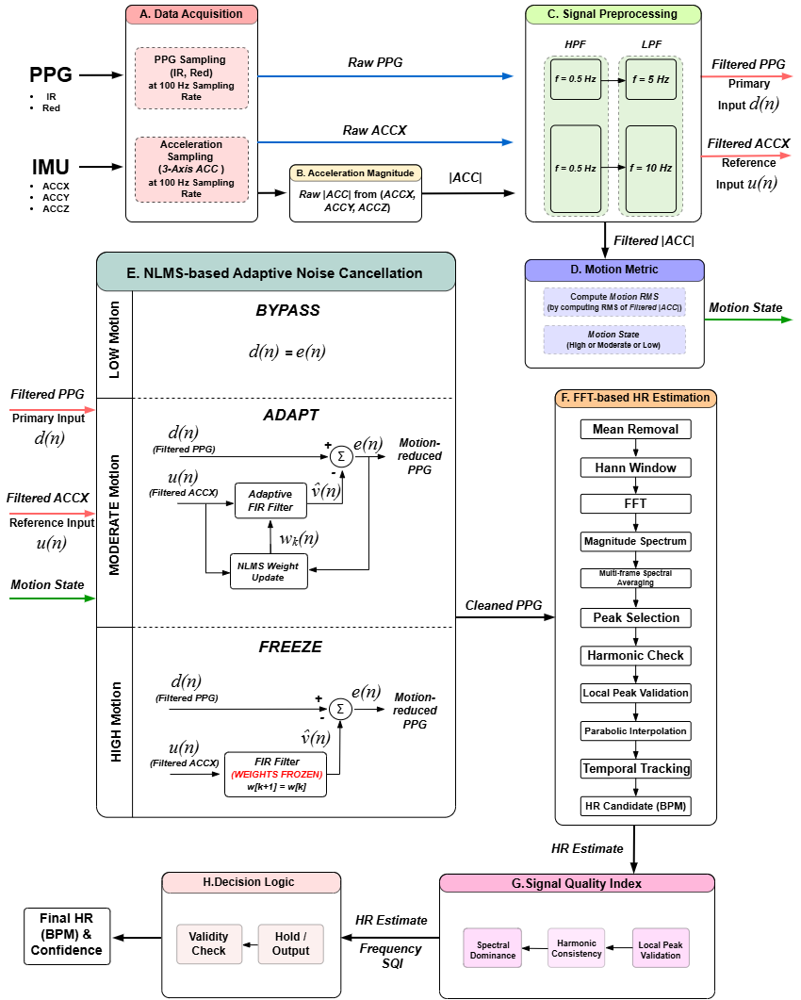

# A Motion-Aware Embedded Heart-Rate Monitoring Framework Using Three-Mode NLMS Adaptive Filtering, Frequency-Domain Estimation, and Signal Quality Assessment

<p align="center">
  
</p>

<p align="center">
  
</p>

<p align="center">
  
</p>

---

## Overview

Motion artifacts remain one of the largest challenges in wearable heart-rate monitoring systems. Even when a photoplethysmography (PPG) sensor can accurately measure heart rate under stationary conditions, hand motion, sensor movement, and variations in sensor–skin contact can significantly degrade signal quality and produce unreliable heart-rate estimates.

This project presents a complete motion-aware heart-rate monitoring framework implemented entirely on an STM32F407 microcontroller. The system combines a MAX30102 PPG sensor and an LSM6DS3 inertial measurement unit (IMU) with a real-time signal processing pipeline designed to maintain accurate heart-rate estimation under varying motion conditions. The framework incorporates motion-state classification, three-mode NLMS adaptive noise cancellation, FFT-based heart-rate estimation, signal quality assessment, and hold-mode decision logic. All signal processing is executed directly on the embedded target at a sampling frequency of 100 Hz, while an ESP32-S3 module provides wireless data transmission and real-time monitoring.

A key contribution of this work is the development of a motion-aware adaptive filtering framework that dynamically switches between **BYPASS**, **ADAPT**, and **FREEZE** modes according to detected motion intensity. Unlike conventional adaptive filters that continuously update coefficients regardless of operating conditions, the proposed approach selectively enables adaptation only when beneficial, reducing unnecessary signal distortion during low-motion conditions and preventing unstable coefficient updates during severe motion.

The complete framework was experimentally evaluated under **no-motion**, **1 Hz**, **2 Hz**, and **3 Hz** hand-swinging conditions using an external pulse oximeter as a reference device. A correlation-based study identified the X-axis acceleration signal as the most effective adaptive-filter reference, and subsequent evaluation demonstrated that this configuration consistently matched or outperformed both a three-axis NLMS implementation and a baseline system without adaptive noise cancellation.

The result is a fully embedded, motion-aware heart-rate monitoring system that demonstrates how adaptive filtering, frequency-domain signal processing, signal quality assessment, and decision-level validation can be combined to produce robust heart-rate estimates under real-world motion conditions.

---

## Key Results

A correlation-based reference selection study identified the X-axis acceleration signal as the most suitable adaptive-filter reference signal.

Across all evaluated motion conditions, the proposed framework achieved the following heart-rate estimation accuracy relative to the reference pulse oximeter:

| Condition   | MAE (BPM) |
| ----------- | --------- |
| No Motion   | 0.71      |
| 1 Hz Motion | 1.08      |
| 2 Hz Motion | 1.14      |
| 3 Hz Motion | 1.19      |

In addition, evaluation of the complete estimation framework demonstrated that the combination of signal quality assessment and hold-mode decision logic substantially improved estimation stability compared with using raw FFT-based heart-rate estimates alone. Under the **3 Hz motion condition**, the final validated heart-rate output achieved:

* MAE reduction from **5.48 BPM** to **1.19 BPM**
* RMSE reduction from **19.73 BPM** to **1.41 BPM**
* **78.3%** improvement in MAE
* **92.9%** improvement in RMSE

These results highlight the importance of estimate validation and decision-level processing in addition to adaptive filtering and frequency-domain heart-rate estimation.

---

## Main Contributions

* Development of a motion-aware heart-rate monitoring framework integrating PPG and IMU sensing.
* Design and implementation of an IMU-referenced NLMS adaptive noise cancellation framework.
* Introduction of a three-mode adaptive filtering strategy consisting of:

  * BYPASS Mode
  * ADAPT Mode
  * FREEZE Mode
* Correlation-based reference signal selection resulting in X-axis acceleration selection for adaptive filtering.
* FFT-based heart-rate estimation incorporating:

  * Spectral averaging
  * Peak validation
  * Continuity-based tracking
  * Confidence estimation
* Signal Quality Assessment (SQI) framework for estimate validation.
* Hold-mode decision logic for rejecting unreliable heart-rate estimates.
* Real-time implementation on an STM32F407 microcontroller operating at 100 Hz.

---

## Hardware Platform

The hardware platform consists of:

* STM32F407 Discovery Board
* MAX30102 Optical PPG Sensor
* LSM6DS3 IMU Sensor
* ESP32-S3 Wireless Communication Module
* 9 V Battery Power System

The STM32F407 performs real-time sensor acquisition and digital signal processing. Processed heart-rate estimates and confidence metrics are transmitted through UART to an ESP32-S3 module, which hosts a Wi-Fi access point and TCP server for wireless monitoring and data logging.

---

## Signal Processing Pipeline

The implemented processing pipeline consists of:

### Block A – Sample Acquisition

* PPG acquisition from MAX30102
* Accelerometer acquisition from LSM6DS3
* 100 Hz sampling rate

### Block B – Acceleration Magnitude Computation

* Motion magnitude generation from 3-axis acceleration

### Block C – Signal Preprocessing

* PPG band-pass filtering
* Acceleration filtering
* DF2T biquad implementation

### Block D – Motion Metric Computation & Motion-State Classification

* RMS motion metric generation
* Low, Moderate, and High motion-state classification

### Block E – Motion-Aware NLMS Adaptive Noise Cancellation

* IMU-referenced adaptive noise cancellation
* Three-mode filtering strategy:

  * BYPASS
  * ADAPT
  * FREEZE

### Block F – FFT-Based Heart-Rate Estimation

* Mean removal
* RMS validation
* Hann windowing
* FFT computation
* Spectral averaging
* Peak selection
* Harmonic validation
* Temporal tracking
* Confidence estimation

### Block G – Signal Quality Assessment

* Confidence evaluation
* Motion-quality evaluation
* Validity assessment

### Block H – Decision Logic

* Estimate validation
* Hold-mode operation
* Final heart-rate generation

These processing stages execute entirely on the STM32F407 microcontroller in real time.

---

## Experimental Evaluation

The framework was evaluated under:

* No Motion
* 1 Hz Motion
* 2 Hz Motion
* 3 Hz Motion

An external fingertip pulse oximeter was used as the reference heart-rate device.

Performance was evaluated using:

* Mean Absolute Error (MAE)
* Root Mean Square Error (RMSE)
* Maximum Error
* Confidence Score
* Hold-Mode Percentage

Reference heart-rate values were manually recorded and synchronized with system outputs for performance analysis.

---

## Repository Structure

```text
motion-aware-hr-monitor/
├── firmware/
│   ├── stm32/
│   └── esp32/
│
├── hardware/
│   ├── images/
│   └── schematics/
│
├── data/
│
├── docs/
│   └── report/
│
├── media/
│   ├── results/
│   └── system_diagrams/
│
├── README.md
└── .gitignore
```

---

## Documentation

The complete engineering report is available in:

docs/report/

---

## Author

**Jehyung Han**

Electrical Engineering

New York University Abu Dhabi (NYUAD)
